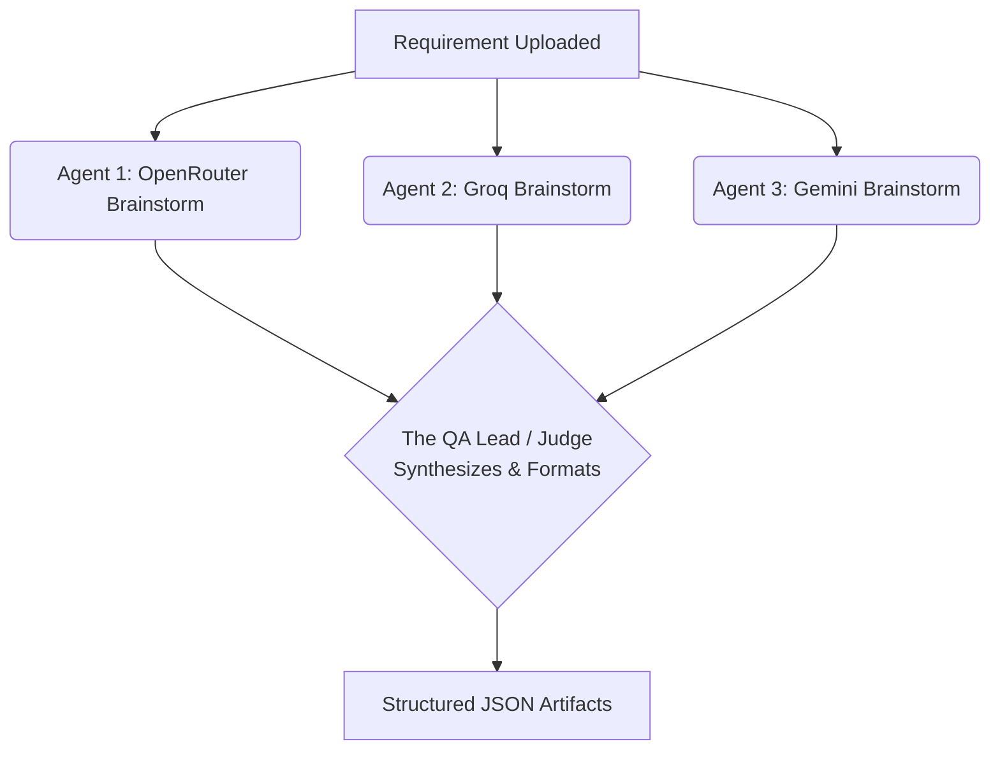
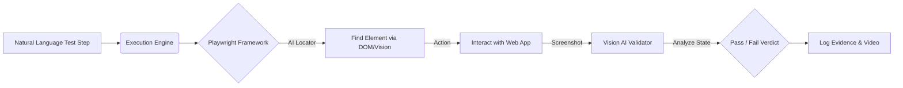

# AI Test Analyst - Presentation Outline

*Note: Due to a browser environment restriction, automated screenshots could not be captured. Please insert your own screenshots in the designated placeholders below.*

---

## 1. Title Slide: AI Test Analyst
**Subtitle:** Accelerating Quality Assurance with Agentic AI
**Value Proposition:** Transform raw requirements into exhaustive, risk-assessed test cases, and *autonomously execute* them against your web applications using Vision AI—shifting QA left and eliminating manual test design and execution bottlenecks.

---

## 2. The Problem: The QA Bottleneck
Before diving into the solution, it's important to understand the pain points of modern software testing:
- **Manual Translation:** QA teams spend hours translating dense PRDs (Product Requirement Documents) into test scenarios.
- **Flaky Automation:** Traditional UI automation (Selenium/Cypress) breaks constantly due to minor UI or DOM changes, requiring endless maintenance.
- **Painful Impact Analysis:** When requirements change, manually finding which test cases are impacted is tedious and prone to regression leaks.
- **Generic AI is Inefficient:** Pasting requirements into ChatGPT requires constant prompting, lacks structured output, and cannot execute tests against a live application.

---

## 3. Our Solution: AI Test Analyst
AI Test Analyst is a purpose-built workspace for Quality Assurance professionals. It acts as an "always-on" QA Co-Pilot that automatically ingests requirements, generates structured artifacts, and autonomously executes tests using AI-driven browser control.

### Key Workflows (The User Journey)

#### A. Seamless Ingestion
Users don't need to copy-paste endlessly. They can directly type requirements or upload standard documentation (PDFs, Word Documents, Excel, CSVs). The platform automatically extracts and structures the context.
> *[Placeholder: Screenshot of the Main Workspace showing the Requirement Text Area and File Upload buttons]*

#### B. One-Click Artifact Generation
With a single click, the platform generates a comprehensive QA suite:
- **High-Level Scenarios:** Core user journeys.
- **Detailed Test Cases:** Step-by-step instructions with expected results.
- **Risk Assessment:** Automatically flags test cases as High, Medium, or Low risk based on business impact.
- **RTM (Requirements Traceability Matrix):** Ensures every feature has corresponding test coverage.
- **Test Suites:** Automatically groups tests into Smoke and Regression suites.
> *[Placeholder: Screenshot of the generated Test Cases table showing Risk Levels in red/yellow/green]*

#### C. Deep-Dive Generators
Users can drill down into individual test cases to leverage specialized AI agents:
- **AI Defect Predictor:** Foresees likely bugs, security vulnerabilities, and logic flaws before a single line of code is written.
- **AI Test Data Generator:** Instantly generates exhaustive payloads (positive, negative, boundary, SQL injection attempts, nulls) for testing.

#### D. Agentic AI Test Execution (Self-Healing Automation)
Unlike legacy tools that just store text, AI Test Analyst can **actually run the tests** against your web application.
- **Autonomous Playwright Engine:** The execution engine reads the natural language test steps and translates them into live browser actions (Click, Type, Navigate).
- **Self-Healing Locators:** It doesn't rely on brittle CSS selectors. The AI intelligently scans the DOM and visual viewport to locate elements even if the developers change the underlying ID or class names.
- **Vision AI Assertions:** During execution, the system captures screenshots and passes them to a Vision AI (like GPT-4o or Gemini). The AI visually validates the page layout, state, and success criteria exactly like a human would.
- **Bulletproof Evidence:** Automatically records videos, network logs, and step-by-step screenshots for every test run to build an undeniable audit trail.
> *[Placeholder: Screenshot of the Test Execution Dashboard showing Video Playback and Vision AI Logs]*

#### E. Smart Versioning & Automated Impact Analysis
When a user updates a requirement, the system saves a snapshot of the old version. 
- **Compare Versions:** Users can compare the old vs. new requirement.
- **Automated Impact Analysis:** The AI highlights exactly what was added, removed, or modified, and automatically flags which existing test cases are impacted by the change, determining the exact regression scope.
> *[Placeholder: Screenshot of the Version History Dropdown and Diff Analysis view]*

---

## 4. How the "Agentic AI" Works (Technical Architecture)
Our platform leverages two distinct AI architectures to handle the full testing lifecycle:

### Part 1: The "Mixture of Experts" (Test Design Phase)
Instead of relying on a single AI model (which can hallucinate or be biased), our application uses an **Agentic Ensemble**.
1. **The Brainstormers (Parallel Agents):** Multiple different AI models (like Groq and OpenRouter) act as independent QA testers, brainstorming test scenarios simultaneously.
2. **The QA Lead (The Judge):** A powerful primary model (Google Gemini) synthesizes the ideas, removes duplicates, and enforces strict, professional formatting into structured JSON.

### Part 2: Vision-Driven Execution Engine (Test Run Phase)
When a test is executed, the Agentic Engine takes over the browser in real-time.

---

## 5. Benefits & ROI
- **Unprecedented Speed:** Reduce test design phase from days to seconds.
- **Maintenance-Free Automation:** Self-healing AI locators mean your team stops fixing broken UI tests and starts focusing on exploratory testing.
- **Shift-Left Quality:** By predicting defects and edge cases during the requirement phase, bugs are caught *before* development begins.
- **Exhaustive Coverage:** The multi-agent ensemble thinks of edge cases a single human tester might miss.
- **Effortless Maintenance:** Automated impact analysis turns a nightmare regression-planning session into a 10-second automated check.

---

## 6. Advantages vs. Competitors
Why choose AI Test Analyst over generic AI chats or legacy tools?
1. **End-to-End Workflow:** Unlike ChatGPT (which only generates text) or Xray (which only stores text), we handle Generation, Risk Analysis, *and* Autonomous Execution in a single pane of glass.
2. **Mixture of Experts:** We don't rely on just one AI. Our Agentic ensemble guarantees higher quality and wider coverage by combining multiple AI models automatically.
3. **True Agentic Execution:** Legacy automation records static clicks. Our engine uses Vision AI to "see" and interact with the page, making automation resilient to UI changes.
4. **Bring Your Own Key (BYOK):** Ultimate flexibility. Users aren't locked into expensive enterprise AI subscriptions; they can plug in their own Gemini/Groq/OpenAI keys to control costs and data privacy.

---

## 7. Disadvantages / Limitations
To maintain transparency, here are current constraints to consider:
1. **Human-in-the-Loop Required:** AI is a powerful co-pilot, but it can occasionally misinterpret ambiguous business logic. A QA professional must still review and approve the generated tests before executing them.
2. **Context Window Limits:** While it supports file uploads, feeding a massive 500-page legacy PRD in a single prompt may exceed current AI memory limits, requiring users to break requirements down into functional modules or epics.
3. **Execution Speed:** Because Vision AI validates the screen visually at runtime, test execution is slower than traditional "headless" scripts, trading raw speed for self-healing resilience.
